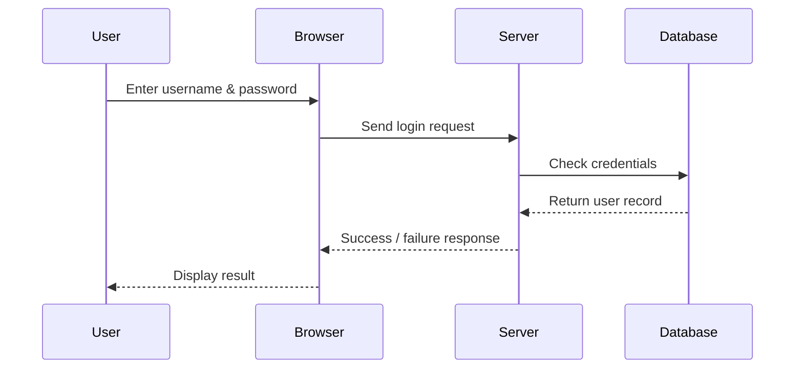

```mermaid
sequenceDiagram
    participant U as User
    participant B as Browser
    participant S as Server
    participant DB as Database

    U->>B: Enter username & password
    B->>S: Send login request
    S->>DB: Check credentials
    DB-->>S: Return user record
    S-->>B: Success / failure response
    B-->>U: Display result
```    
